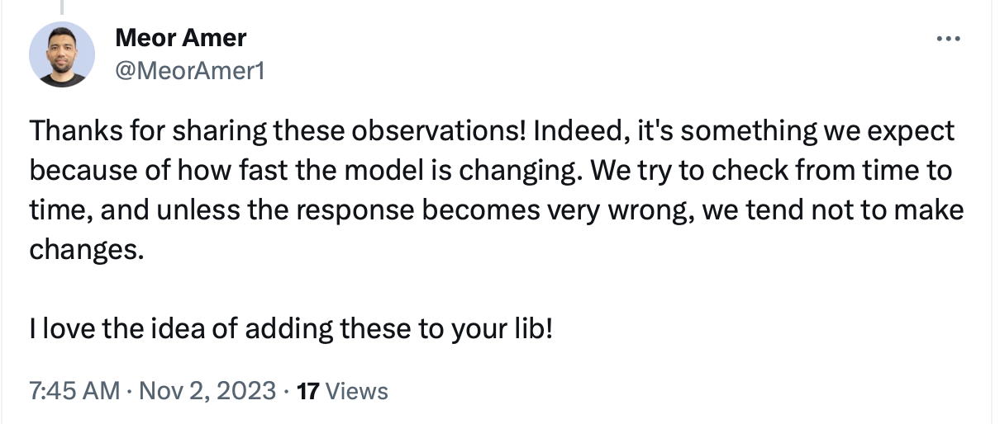
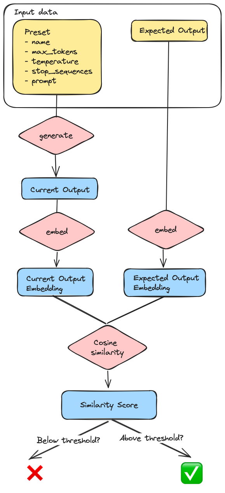

# Tests to validate the Cohere presets correctness

## What led to this mini project

In Cohere's API documentation, there are 2 pages with a list of preset examples:
- [Generative AI with Cohere: Part 2 - Use Case Ideation](https://txt.cohere.com/generative-ai-part-2/?_gl=1*1q1feyq*_ga*MTUxMTc4MDM1OS4xNjk4NDA4Mzk0*_ga_CRGS116RZS*MTY5ODczNzQxNy4xMC4xLjE2OTg3NDE3NTMuNTMuMC4w)
- [Use Case Ideation](https://docs.cohere.com/docs/use-case-ideation)

And here's the list of the current example use cases (which links to their presets):
- [Turning Product Features into Benefits](https://dashboard.cohere.ai/playground/shared-preset?ref=Product-Feature-to-Benefit-kddeaq&{query}&__hstc=14363112.4c7496d8370c0fedd2ec614ad3b4b31f.1698408367010.1698737477922.1698739703142.15&__hssc=14363112.18.1698739703142&__hsfp=2413774647)
- [Generating a Product Pitch](https://dashboard.cohere.ai/playground/shared-preset?ref=Product-Pitch-8n7dkb&{query}&__hstc=14363112.4c7496d8370c0fedd2ec614ad3b4b31f.1698408367010.1698737477922.1698739703142.15&__hssc=14363112.18.1698739703142&__hsfp=2413774647)
- [Creating a Business Model Canvas](https://dashboard.cohere.ai/playground/shared-preset?ref=Business-Model-Canvas-55np7x&{query}&__hstc=14363112.4c7496d8370c0fedd2ec614ad3b4b31f.1698408367010.1698737477922.1698739703142.15&__hssc=14363112.18.1698739703142&__hsfp=2413774647)
- [Extracting Keywords from Emails](https://dashboard.cohere.ai/playground/shared-preset?ref=Email-Keyword-Extraction-5ghcwn&{query}&__hstc=14363112.4c7496d8370c0fedd2ec614ad3b4b31f.1698408367010.1698737477922.1698739703142.15&__hssc=14363112.18.1698739703142&__hsfp=2413774647)
- [Simplifying Technical Concepts](https://dashboard.cohere.ai/playground/shared-preset?ref=Simplify-Technical-Concepts-tcjifr&{query}&__hstc=14363112.4c7496d8370c0fedd2ec614ad3b4b31f.1698408367010.1698737477922.1698739703142.15&__hssc=14363112.18.1698739703142&__hsfp=2413774647)
- [Composing an Email](https://dashboard.cohere.ai/playground/shared-preset?ref=Keywords-to-Email-egyyi5&{query}&__hstc=14363112.4c7496d8370c0fedd2ec614ad3b4b31f.1698408367010.1698737477922.1698739703142.15&__hssc=14363112.18.1698739703142&__hsfp=2413774647)
- [Writing in a Victorian Style](https://dashboard.cohere.ai/playground/shared-preset?ref=Victorian-Style-Writing-1zgye4&{query}&__hstc=14363112.4c7496d8370c0fedd2ec614ad3b4b31f.1698408367010.1698737477922.1698739703142.15&__hssc=14363112.18.1698739703142&__hsfp=2413774647)

As I went through the Victorian Style example, I realized that the preset's prompt wasn't giving the expected output, regardless of how many times I ran the prompt.

Here's what was expected:

> I am at peace, with the weight of the world removed from my shoulders, and with a clear mind, untroubled by the trivialities of life, I feel an untroubled joy, and an untroubled hope, for my future.

And here are the 3 results I got (We are not expecting exactly similar results, but at least some similarity):

> 1. "Though the protagonist had a tendency to embellish his sentences, the rephrased versions still maintained the original meaning. The habit of the Victorian novelist didn't change the essence of the sentences but added more detail and flourish. When the protagonist wrote, "
> 2. "Though the man had a way with words, I found it difficult to communicate with him knowing he'd edit everything I said."
> 3. "Though the literary floridness of the Victorian novelist's style is certainly a bit ostentatious and overexaggerated, it seems that it was perhaps a bit much to characterize those whom you refer to as "

I assumed that the model must have changed since the preset's prompt was written.

I reached out to [@mrmer1](https://github.com/mrmer1), the documentation's author, who confirmed my analysis:

> We made some model updates recently and the prompt now works best with an instruction-style text.

This got me thinking: I discovered the mismatch as a user, but the documentation team wasn't aware of this mismatch.

Now how could we guarantee that the presets' outputs remain relevant, as the model is regularly updated?

Surely we can't expect the documentation team to manually run all the presets regularly.

This mini project is an attempt to automatically validate that the outputs are similar to what we expect.

## Later update

It turns out that this lib can be used not simply to validate the presets in the Playground, but also to validate prompts and their expected responses in various notebooks.

For instance in the [Construction Prompts](https://docs.cohere.com/docs/constructing-prompts) course, there are dozens of outputs generated, and it would be useful to know when an update in the model leads to significant changes, as agreed by [@mrmer1](https://github.com/mrmer1):



We are only importing prompts for which the temperature is at maximum 0.5. Above that, it becomes too random and it doesn't make sense to expect outputs to have a strong cosine similarity.

## How does it work

The approach is very simple and goes through the following steps:
- Manually list all the presets data in `presets.py`. For each preset, we have the following entries:
   - `name`
   - `max_tokens`
   - `temperature`
   - `stop_sequences`
   - `prompt`
   - `expected_output`
- For each preset, call Cohere's [generate](https://docs.cohere.com/reference/generate) endpoint with all the inputs from `presets.py` (except the `expected_output`) to get the current output
- Get the vector embeddings for both the current and expected outputs using Cohere's [embed](https://docs.cohere.com/reference/embed) endpoint
- Compare the current and expected outputs using scikit-learn's [cosine similarity](https://scikit-learn.org/stable/modules/generated/sklearn.metrics.pairwise.cosine_similarity.html), giving a value between 0 (completely different) and 1 (exactly similar)
- Display the similarity score for each preset
- If the score is above a given threshold (setup in `minimum_cosine_similarity` in `config.py`), pass the test (✅), otherwise fail (❌)

Here's the flow in a diagram:



## How to run the script

- Enter your Cohere API key in `config.py`. If you don't have any, you can get a Trial key for free in the [Cohere Dashboard](https://dashboard.cohere.com/api-keys). Note that you won't be able to run the script for all the presets at once using the Trial key since it is rate limited to 10 API calls per minute, and here we are making 3 API calls per preset (1 to generate the output and 2 to get the embeddings)
- Decide what your minimum similarity threshold is in `minimum_cosine_similarity` in `config.py`
- Install the `cohere`, `numpy` and `sklearn` libraries (`pip install cohere numpy sklearn`)
- Run the script (in my case, I'm using Python 3.10, so: `python3.10 main.py`)

You should see something like this in your terminal:

```
✅, Preset Name: Playground Generate Showcase - Product Feature to Benefit, Cosine Similarity: 0.98
✅, Preset Name: Playground Generate Showcase - Product Pitch, Cosine Similarity: 0.89
✅, Preset Name: Playground Generate Showcase - Business Model Canvas, Cosine Similarity: 0.89
✅, Preset Name: Playground Generate Showcase - Email Keyword Extraction, Cosine Similarity: 0.99
✅, Preset Name: Playground Generate Showcase - Simplify Technical Concepts, Cosine Similarity: 0.81
❌, Preset Name: Playground Generate Showcase - Keywords To Email, Cosine Similarity: 0.50
❌, Preset Name: Playground Generate Showcase - Victorian Style Writing, Cosine Similarity: 0.76
✅, Preset Name: Constructing prompts - Instruction, Cosine Similarity: 0.83
✅, Preset Name: Constructing prompts - Specifics, Cosine Similarity: 0.88
✅, Preset Name: Constructing prompts - Structured, Cosine Similarity: 0.83
✅, Preset Name: Constructing prompts - Without Context, Cosine Similarity: 0.82
✅, Preset Name: Constructing prompts - With Context, Cosine Similarity: 0.93
❌, Preset Name: Constructing prompts - Without Examples, Cosine Similarity: 0.67
❌, Preset Name: Constructing prompts - With Examples, Cosine Similarity: 0.57
❌, Preset Name: Constructing prompts - Without Examples (Chain of Thought), Cosine Similarity: 0.48
✅, Preset Name: Constructing prompts - With Examples (Chain of Thought), Cosine Similarity: 0.97
❌, Preset Name: Constructing prompts - Table Format, Cosine Similarity: 0.63
✅, Preset Name: Constructing prompts - JSON Format, Cosine Similarity: 0.82
❌, Preset Name: Constructing prompts - Without Steps, Cosine Similarity: 0.54
✅, Preset Name: Constructing prompts - With Prefix (Zero Shot Chain of Thought), Cosine Similarity: 0.81
```

This tells us that the `Keywords To Email` and `Victorian Style Writing` presets' prompts need to be updated. And indeed, if we have a look at the presets, we see that the current output is way too different from the expected output.
